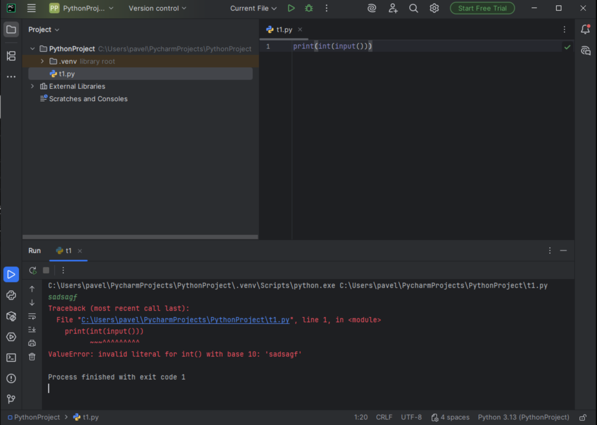

# Тема 2. Базовые операции языка Python.
Отчет по Теме 2 выполнил:

* Коновалов Павел Павлович 
* ПИЭ-23-1

| Задание | Лаб_раб | Сам_раб |
|---|---|---|
| Задание 1 | + | + |
| Задание 2 | + | + |
| Задание 3 | + | + |
| Задание 4 | + | + |
| Задание 5 | + | + |
| Задание 6 | + | + |
| Задание 7 | + | + |
| Задание 8 | + | + |
| Задание 9 | + | + |
| Задание 10 | + | + |

# Лабораторная работа №2.  
## 1) Выведите в консоль три строки. Первая – любое число. Вторая – любое число в виде строки. Третья – любое число с плавающей точкой.
```python
print(123)  
print('123')  
print(1.23)
```


## 2) Выведите в консоль три строки. Первая – любое число. Вторая – любое число в виде строки. Третья – любое число с плавающей точкой.
```python
print(1823-486)  
print(5.1 + 8.27)  
print(3 + 7.04 + 1 + 2.33)
```


## 3) Выведите в консоль три строки. Первая – обычная строка. Вторая – F строка с использованием заранее объявленной переменной. Третья – сложите две или более строк в одну
```python
print('Привет Мир!')

world = 'Мир'
print(f"Privet, {world}!")

one = 'Привет, '
two = 'Мир!'
print(one+two)
```


## 4) Выведите в консоль три строки. Первая – трансформация любого типа переменной в bool. Вторая – трансформация любого типа переменной в float или int. Третья – трансформация любого типа переменной в str.
```python
one = 'Hello'
print(bool(one))

two = 142
print(float(two))

three = None
print(str(three))
```


## 5) Присвойте трем переменным различные значения, воспользовавшись функцией input()
```python
one = input("one: ")
two = input("two: ")
three = input("three: ")
print(one, two, three)
```


## 6) Создайте две любые числовые переменные и выполните над ними несколько математических   операций: возведение в степень, обычное деление, целочисленное деление, нахождение   остатка от деления. При желании вы можете проверить как работают эти вычисления с   разными типами данных, например, сначала создать две переменные int, затем создать две   переменные float и наконец создать переменные типа int и float и провести над ними   операции, прописанные выше.
```python
a = 52
b = 23
print('Возведение в степень: ', a**b)
print('Обычное деление: ', a/b)
print('Целочисленное деление', a//b)
print('Нахождение остатка от деления: ', a%b)
```


## 7) Создайте любую строковую переменную и произведите над ней математическое действие умножение на любое число.
```python
line = 'Pavel10!'
print(line*7)
```


## 8) Посчитайте сколько раз символ ‘o’ встречается в строке ‘Hello World’.
```python
sentence = 'Hello Wolrd'
print(sentence.count('o'))
```


## 9) Напишите предложение ‘Hello World’ в две строки. Написанная программа должна занимать одну строку в редакторе кода
```python
print('Hello\nWorld')
```


## 10) Из предложения ‘Hello World’ выведите в консоль только 2 символ, а затем выведите слово ‘Hello’
```python
sentence = 'Hello World!'
print(sentence[1])
print(sentence[:5])
```


# Самостоятельная работа №2. 

## 1) Выведите в консоль булевую переменную False, не используя слово False в строке или изначально присвоенную булевую переменную. Программа должна занимать не более двух строк редактора кода.
```python
print(not True)
```


Вывод: Сделал не True, получилось False


## 2) Присвоить значения трем переменным и вывести их в консоль, используя только две строки редактора кода
```python
a, b, c = 1, 2, 3;
print(a, b, c)
```


Вывод: Использует множественное присваивание и вывод в одной строке через точку с запятой. Эффективное использование синтаксиса.


## 3) Реализуйте ввод данных в программу, через консоль, в виде только целых чисел (тип данных int). То есть при вводе буквенных символов в консоль, программа не должна работать. Программа должна занимать не более двух строк редактора кода
```python
print(int(input()))
```


Вывод: Сделал так, что программа принимает только цифры. Если буквы введешь - выдаст ошибку.

## 4) Создайте только одну строковую переменную. Длина строки должна не превышать 5 символов. На выходе мы должны получить строку длиной не менее 16 символов. Программа должна занимать не более двух строк редактора кода.
```python
s = "11111"
print(s * 4)
```


Вывод: Взял короткую строку из 5 символов и умножил ее на 4 - получилось 20 символов


## 5) Создайте три переменные: день (тип данных - числовой), месяц (тип данных - строка), год (тип данных - числовой) и выведите в консоль текущую дату в формате: “Сегодня день месяц год. Всего хорошего!” используя F строку и оператор end внутри print(), в котором вы должны написать фразу “Всего хорошего!”. Программа должна занимать не более двух строк редактора кода.
```python
day, month, year = 21, "сентября", 2025;
print(f"Сегодня {day} {month} {year}.", end=" Всего хорошего!")
```


Вывод: Собрал дату из дня, месяца и года, и добавил "Всего хорошего!" в конце без новой строки.


## 6) В предложении ‘Hello World’ вставьте ‘my’ между двумя словами. Выведите полученное предложение в консоль в одну строку. Программа должна занимать не более двух строк редактора кода.
```python
print('Hello ' + 'my ' + 'World')
```


Вывод: Собрал фразу "Hello my World" из трех частей сложением.


## 7) Узнайте длину предложения ‘Hello World’, результат выведите в консоль. Программа должна занимать не более двух строк редактора кода
```python
print(len('Hello World'))
```


Вывод: Посчитал, что "Hello World" состоит из 11 символов (буквы + пробел).


## 8) Переведите предложение ‘HELLO WORLD’ в нижний регистр. Программа должна занимать не более двух строк редактора кода
```python
print('HELLO WORLD'.lower())
```


Вывод: Перевел большие буквы "HELLO WORLD" в маленькие "hello world".


## 9) Самостоятельно придумайте задачу по проходимой теме и решите ее. Задача должна быть связанна со взаимодействием с числовыми значениями
```python
x, y = 7, 4 
print(f"Сумма: {x+y}, Разность: {x-y}, Произведение: {x*y}")
```


Вывод: Сделал калькулятор: сложил, вычел и умножил два числа.


## 10) Самостоятельно придумайте задачу по проходимой теме и решите ее. Задача должна быть связанна со взаимодействием со строковыми значениями.
```python
text = "Программная инженерия"
print(f"Длина: {len(text)}, Первые 8 символов: {text[:8]}")
```


Вывод: Посчитал длину строки "Программная инженерия" и показал первые 8 букв.

# Вывод 
Успешно освоены базовые операции Python: работа с типами данных, строками, вводом/выводом и форматированием.
