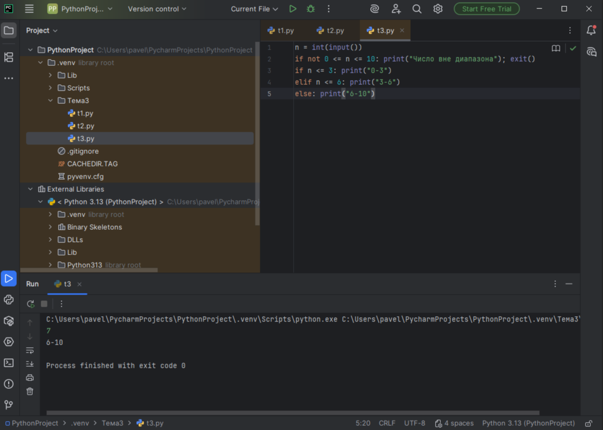

# Тема 3. Операторы, условия, циклы.
Отчет по Теме 3 выполнил:

* Шулешов Максим Андреевич
* ИВТ-23-2

# Лабораторная работа №3.  
## 1) Создайте две переменные, значение которых будете вводить через консоль. Также составьте условие, в котором созданные ранее переменные будут сравниваться, если условие выполняется, то выведете в консоль «Выполняется», если нет, то «Не выполняется».
```python
one = int(input("Введите значение первой переменной: "))
two = int(input("Введите значение второй переменной: '))
if one >= two:
    print("Выполняется')
else:
    print('Не выполняется')
```


## 2) Напишите программу, которая будет определять значения переменной меньше 0, больше 0 и меньше 10 или больше 10. Это нужно реализовать при помощи одной переменной, значение которой будет вводится через консоль, а также при помощи конструкций if, elif, else.
```python
one = int(input('Введите значение переменной: '))
if one < 0:
    print('Переменная меньше 0')
elif 0 < one < 10:
    print('Переменная больше 0 и меньше 10')
else:
    print('Переменная больше 10')
```


## 3) Напишите программу, в которой будет проверяться есть ли переменная в указанном массиве используя логический оператор in. Самостоятельно посмотрите, как работает программа со значениями которых нет в массиве numbers.

```python
numbers = [1, 3, 4, 6, 8, 9]
value = int(input('Введите значение переменной: '))
if value in numbers:
    print('Переменная есть в данном массиве')
else:
    print('Переменной нет в этом массиве')
```


## 4) Напишите программу, которая будет определять находится ли переменная в указанном массиве и если да, то проверьте четная она или нет. Самостоятельно протестируйте данную программу с разными значениями переменной value
```python
numbers = [1, 3, 4, 6, 8, 9, 15, 16, 73, 321, 322]
value = int(input('Введите значение переменной: '))
if value in numbers:
    if value % 2 == 0:
        print('Переменная четная и есть в массиве numbers')
    else:
        print('Переменная нечетная и есть в массиве numbers')
else:
    print(f"Переменной нет в массиве numbers и она равна {value}")
```


## 5) Напишите программу, в которой циклом for значения переменной i будут меняться от 0 до 10 и посмотрите, как разные виды сравнений и операций работают в цикле.

```python
for i in range(10):
    print('i = ', i)
    if i == 0:
        i += 2
    if i == 1:
        continue
    if i == 2 or i == 3:
        print('Переменная равна 2 или 3')
    elif i in [4, 5, 6]:
        print('Переменная равна 4,5 или 6')
    else:
        break
```


## 6) Напишите программу, в которой при помощи цикла for определяется есть ли переменная value в строке string и посмотрите, как работает оператор else для циклов. Самостоятельно посмотрите, что выведет программа, если значение переменной value оказалось в строке string.
```python
string = 'Привет всем изучающим Python!"
value = input()

if falue in string:
    index = string.find(value)
    print(f"Буква '{value}' есть в строке под {index} индексом")
else:
    print(f"Буквы '{value}' нет в указанной строке")
```


## 7) Напишите программу, в которой вы наглядно посмотрите, как работает цикл for проходя в обратном порядке, то есть, к примеру не от 0 до 10, а от 10 до 0. В уже готовой программе показано вычитание из 100, а вам во время реализации программы будет необходимо придумать свой вариант применения обратного цикла.
```python
value = 100
for i in range(10, -1, -1):
value -= i
print(i, value)
```


## 8) Напишите программу используя цикл while, внутри которого есть какие-либо проверки
```python
value = 0
while value < 100:
    if value == 0:
        value += 10
    elif value // 5 > 1:
        value *= 5
    else:
        value -= 5
    print(value)
```


## 9) Напишите программу с использованием вложенных циклов и одной проверкой внутри них. Самое главное, не забудьте, что нельзя использовать одинаковые имена итерируемых переменных, когда вы используете вложенные циклы
```python
value = 0
for i in range(10):
    for j in range(10):
        if i != j:
            value += j
        else:
            pass 
print(value)
```


## 10) Напишите программу с использованием flag, которое будет определять есть ли нечетное число в массиве. В данной задаче flag выступает в роли индикатора встречи нечетного числа в исходном массиве, четных чисел.
```python
even_array = [2, 4, 6, 8, 9]
flag = False
for value in even_array:
    if value % 2 == 1:
        flag = True

if flag is True:
    print('В массиве есть нечетное число')
else:
    print('В массиве все числа четные')
```


# Самостоятельная работа №2. 

## 1) Напишите программу, которая преобразует 1 в 31. Для выполнения поставленной задачи необходимо обязательно и только один раз использовать: • Цикл for • *= 5 • += 1 Никаких других действий или циклов использовать нельзя
```python
x = 1
for i in range(2):
    x *= 5
    x += 1
print(x)
```


Вывод: Задача решается за 2 итерации цикла: сначала 1×5+1=6, затем 6×5+1=31


## 2) Напишите программу, которая фразу «Hello World» выводит в обратном порядке, и каждая буква находится в одной строке консоли редактора кода
```python
for char in "Hello World"[::-1]:
    print(char)
```


Вывод: Строка переворачивается задом наперед с помощью среза [::-1], и каждая буква выводится в отдельной строке.


## 3) Напишите программу, на вход которой поступает значение из консоли, оно должно быть числовым и в диапазоне от 0 до 10 включительно (это необходимо учесть в программе). Если вводимое число не подходит по требованиям, то необходимо вывести оповещение об этом в консоль и остановить программу. Код должен вычислять в каком диапазоне находится полученное число. Нужно учитывать три диапазона: • от 0 до 3 включительно • от 3 до 6 • от 6 до 10 включительно Результатом работы программы будет выведенный в консоль диапазон. Программа должна занимать не более 10 строчек в редакторе кода.
```python
n = int(input())
if not 0 <= n <= 10: print("Число вне диапазона"); exit()
if n <= 3: print("0-3")
elif n <= 6: print("3-6")
else: print("6-10")
```


Вывод: Программа проверяет число от 0 до 10 и определяет, в какой из трех диапазонов оно попадает, с проверкой на ошибки.

## 4) Манипулирование строками. Напишите программу на Python, которая принимает предложение (на английском) в качестве входных данных от пользователя
```python
sentence = input("Введите предложение: ")
print("Длина:", len(sentence))
print("Нижний регистр:", sentence.lower())
print("Гласные:", sum(1 for char in sentence.lower() if char in 'aeiou'))
print("Замена ugly:", sentence.replace('ugly', 'beauty'))
print("Начинается с 'The':", sentence.startswith('The'))
print("Заканчивается на 'end':", sentence.endswith('end'))
```


Вывод: Программа показывает разные операции со строками: длину, регистр, подсчет гласных, замену слов и проверку начала/конца предложения.


## 5) Составьте программу, результатом которой будет данный вывод в консоль:
```python
string = 'hello'
values = [0, 2, 4, 6, 8, 10]
counter = 0
while ' world' not in string:
    memory = string
    if counter in values:
        string = string + ' world'
    print(string)
    if counter < 10:
        string = memory
    counter += 1
```


Вывод: Собрал код из кусочков и получил нужынй вывод.


# Вывод 
В ходе работы успешно освоены основные конструкции Python: условия, циклы и операции со строками. Все задачи выполнены.

