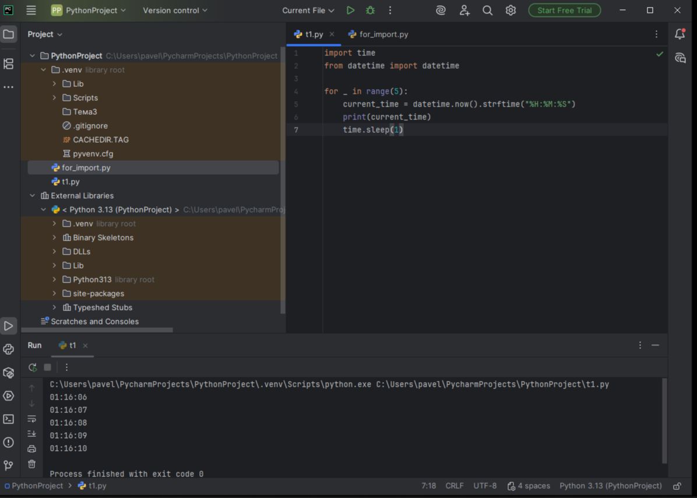

# Тема 4. Функции и модули.
Отчет по Теме 4 выполнил:

* Шулешов Максим Андреевич 
* ИВТ-23-2

# Лабораторная работа №4.  
## 1) ) Напишите функцию, которая выполняет любые арифметические действия и выводит результат в консоль. Вызовите функцию используя “точку входа”.
```python
def main():
    print(2+2)
if __name__ == '__main__':
    main()
```


## 2) Напишите функцию, которая выполняет любые арифметические действия, возвращает при помощи return значение в место, откуда вызывали функцию. Выведите результат в консоль. Вызовите функцию используя “точку входа”.
```python
def main():
    return 2+2
if __name__ == '__main__':
    print(main())
```


## 3) Напишите функцию, в которую передаются два аргумента, над ними производится арифметическое действие, результат возвращается туда, откуда эту функцию вызывали. Выведите результат в консоль. Вызовите функцию в любом небольшом цикле.

```python
def main(one, two):
    result = one + two
    return result
for i in range(5):
    x = 1
    y = 10
    answer = main(x, y)
    print(answer)
```


## 4) Напишите функцию, на вход которой подается какое-то изначальное неизвестное количество аргументов, над которыми будет производится арифметические действия. 
```python
def main(x, *args):
    one = x 
    two = sum(args)
    three = float(len(args))

    print(f"one={one}\ntwo={two}\nthree={three}")
    return x + sum(args) / float(len(args))

if __name__ == '__main__':
    result = main(10, 0, 1, 2, -1, 0, -1, 1, 2)
    print(f"\nresult={result}")
```


## 5) Напишите функцию, которая на вход получает кортеж “**kwargs” и при помощи цикла выводит значения, поступившие в функцию.

```python
def main(**kwargs):
    for i in kwargs.items():
        print(i[0], i[1])
    print()

    for key in kwargs:
        print(f"{key} = {kwargs[key]}")
if __name__ == '__main__'
    main(x=[1, 2, 3], y=[3, 3, 0], z=[2, 3, 0], q=[3, 3, 0], w=[3, 3, 0])
    print()
    main(**{'x': [1, 2, 3], 'y': [3, 3, 0]})
```


## 6) Напишите две функции. Первая – получает в виде параметра “**kwargs”. Вторая считает среднее арифметическое из значений первой функции. Вызовите первую функцию используя “точку входа” и минимум 4 аргумента.
```python
def main(**kwargs):
    for i, j in kwargs.items():
        print(f"{i}. Mean = {mean(j)}")

def mean(data):
    return sum(data) / float(len(data))

if __name__ == '__main__':
    main(x=[1, 2, 3], y=[3, 3, 0])
```


## 7) Создайте дополнительный файл .py. Напишите в нем любую функцию, которая будет что угодно выводить в консоль, но не вызывайте ее в нем. Откройте файл main.py, импортируйте в него функцию из нового файла и при помощи “точки входа” вызовите эту функцию.
```python
def say_hello():
    print('Hello students!')


from for_inport import say_hello

if __name__ == '__main__':
    say_hello()
```


## 8) Напишите программу, которая будет выводить корень, синус, косинус полученного от пользователя числа.
```python
import math

def main():
    value = int(input('Введите значение: '))
    print(math.sqrt(value))
    print(math.sin(value))
    print(math.cos(value))

if __name__ == '__main__':
    main()
```


## 9) Напишите программу, которая будет рассчитывать какой день недели будет через n-нное количество дней, которые укажет пользователь.

```python
from datetime import datetime as dt
from datetime import timedelta as td

def main():
    print(
        f"Сегодня {dt.today().date()}. "
        f"День недели - {dt.today().isoweekday()}"
    )
    n = int(input('Введите количество дней: '))
    today = dt.today()
    result = today + td(days=n)
    print(
        f"Через {n} дней будет {result.date()}. "
        f"День недели - {result.isoweekday()}-"
    )

if __name__ == '__main__':
    main()
```


## 10) Напишите программу с использованием глобальных переменных, которая будет считать площадь треугольника или прямоугольника в зависимости от того, что выберет пользователь
```python
global result

def rectangle():
    a = float(input("Ширина: "))
    b = float(input("Высота: "))
    global result
    result = a * b

def triangle():
    a = float(input("Основание: "))
    h = float(input("Высота: "))
    global result
    result = 0.5 * a * h

figure = input("1-прямоугольник, 2-треугольник: ")

if figure == '1':
    rectangle()
elif figure == '2':
    triangle()

print(f"Площадь: {result}")
```


# Самостоятельная работа №2. 

## 1) Дайте подробный комментарий для кода, написанного ниже. Комментарий нужен для каждой строчки кода, нужно описать что она делает. Не забудьте, что функции комментируются по-особенному.


Вывод: научился читать и объяснять чужой код. Теперь могу разобраться, что делает каждая строка программы.


## 2) Напишите программу, которая будет заменять игральную кость с 6 гранями. Если значение равно 5 или 6, то в консоль выводится «Вы победили», если значения 3 или 4, то вы рекурсивно должны вызвать эту же функцию, если значение 1 или 2, то в консоль выводится «Вы проиграли». При этом каждый вызов функции необходимо выводить в консоль значение “кубика”
```python
import random

def dice_roll():
    value = random.randint(1, 6)
    print(f"Выпало: {value}")
    if value == 5 or value == 6:
        print("Вы победили")
    elif value == 3 or value == 4:
        dice_roll()
    else:
        print("Вы проиграли")

if __name__ == '__main__':
    dice_roll()
```


Вывод: понял, как работает рекурсия. Функция может вызывать саму себя, если выпадают определенные числа.


## 3) Напишите программу, которая будет выводить текущее время, с точностью до секунд на протяжении 5 секунд. Программу нужно написать с использованием цикла
```python
import time
from datetime import datetime

for _ in range(5):
    current_time = datetime.now().strftime("%H:%M:%S")
    print(current_time)
    time.sleep(1)
```


Вывод: узнал, как заставить программу работать с интервалами. Теперь умею выводить время каждую секунду.

## 4) Напишите программу, которая считает среднее арифметическое от аргументов вызываемое функции, с условием того, что изначальное количество этих аргументов неизвестно. Программу необходимо реализовать используя одну функцию и “точку входа”
```python
def average(*args):
    if len(args) == 0:
        return 0
    return sum(args) / len(args)

if __name__ == '__main__':
    print(average(15, 35, 70, 100))
```


Вывод: научился писать универсальные функции, которые работают с любым количеством чисел.


## 5) ) Создайте два Python файла, в одном будет выполняться вычисление площади треугольника при помощи формулы Герона (необходимо реализовать через функцию), а во втором будет происходить взаимодействие с пользователем (получение всей необходимой информации и вывод результатов). Напишите эту программу и выведите в консоль полученную площадь
```python
from heron import heron

a = float(input("Введите длину стороны a: "))
b = float(input("Введите длину стороны b: "))
c = float(input("Введите длину стороны c: "))

area = heron(a, b, c)
print(f"Площадь треугольника: {area:.2f}")
```


Вывод: понял, как разбивать программу на несколько файлов. Один файл для расчетов, другой - для общения с пользователем.


# Вывод 
В ходе выполнения работы я освоил ключевые концепции работы с функциями и модулями в Python.

