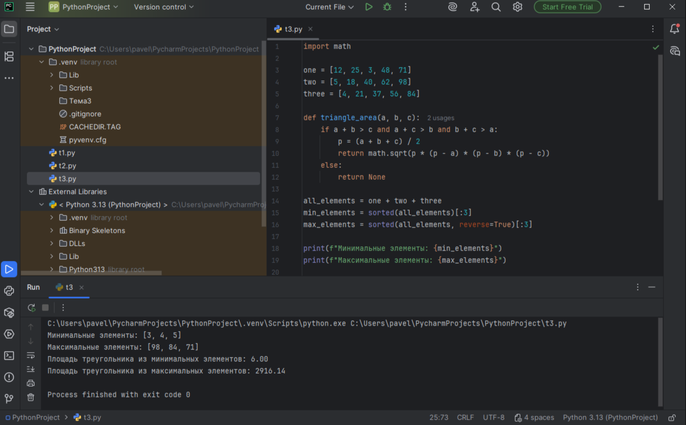

# Тема 5. Базовые коллекции: множества, списки.
Отчет по Теме 5 выполнил:

* Шулешов Максим Андреевич 
* ИВТ-23-2

# Лабораторная работа №5.  
## 1) Друзья предложили вам поиграть в игру “найди отличия и убери повторения (версия для программистов)”. Суть игры состоит в том, что на вход программы поступает два множества, а ваша задача вывести все элементы первого, которых нет во втором. А вы как раз недавно прошли множества и знаете их возможности, поэтому это не составит для вас труда.
```python
set_1 = {'White', 'Black', 'Red', 'Pink'}
set_2 = {'Red', 'Green', 'Blue', 'Red'}

print(set_1 - set_2)
```


## 2) Напишите две одинаковые программы, только одна будет использовать set(), а вторая frozenset() и попробуйте к исходному множеству добавить несколько элементов, например, через цикл.
```python
a = set('abcdefghij')
print(a)
for i in range(1, 5):
    a.add(i)
print(a)
```


## 3) На вход в программу поступает список (минимальной длиной 2 символа). Напишите программу, которая будет менять первый и последний элемент списка

```python
def replace(input_list):
    memory = input_list[0]
    input_list[0] = input_list[-1]
    input_list[-1] = memory

    return input_list

print(replace([1,2,3,4,5]))
```


## 4) На вход в программу поступает список (минимальной длиной 10 символов). Напишите программу, которая выводит элементы с индексами от 2 до 6. В программе необходимо использовать “срез”.
```python
a = [21, 12, 3, 45, 67, 31, 56, 154, 5677, 12, 34]
print(a[2:6])
```


## 5) Иван задумался о поиске «бесполезного» числа, полученного из списка. Суть поиска в следующем: он берет произвольный список чисел, находит самое большое из них, а затем делит его на длину списка. Студент пока не придумал, где может пригодиться подобное значение, но ищет у вас помощи в реализации такой функции useless()

```python
def useless(lst):
    return max(lst) / len(lst)

print(useless([1,2,3,4,5]))
print(useless([-12.5, 12, -45, 23, 123, -333]))
print(useless([-12222.2, 313131, 3333, -23.45]))
```


## 6) Ребята не могут определится каким супергероем они хотят стать. У них есть случайно составленный список супергероев, и вы должны определить кто из ребят будет каким супергероем. Необходимо использовать разделение списков.
```python
superheroes = ['superman', 'spiderman', 'batman']

nikolay, vasiliy, ivan = superheroes

print('Николай - ', nikolay)
print('Василий - ', vasiliy)
print('Иван - ', ivan)
```


## 7) Вовочка, насмотревшись передачи “Слабое звено” решил написать программу, которая также будет находить самое слабое звено (минимальный элемент) и удалять его, только делать он это хочет не с людьми, а со списком. Помогите Вовочке с реализацией программы. 
```python
a = [-25.8, 86, 12.5, -56, 73.2, 0, 43, -91.5, 65.9, -7]
a.sort()
print('Остортированный список:\n', a)
a.pop(0)
print('Отсортированный список без наименьшего элемента :\n', a)
```


## 8) Михаил решил создать большой n-мерный список, для этого он случайным образом создал несколько списков, состоящих минимум из 3, а максимум из 10 элементов и поместил их в один большой список. Он также как и Иван не знает зачем ему это сейчас нужно, но надеется на то, что это пригодится ему в будущем.
```python
from random import randint

def list_maker():
    a = [randint(1, 100)] * randint(3, 10)
    return a

if __name__ == '__main__':
    result = []
    for i in range(randint(1, 5)):
        result.append(list_maker())

    print(result)
```


## 9) Вы работаете в ресторане и отвечает за статистику покупок, ваша задача сравнить между собой заказы покупателей, которые указаны в разном порядке. Реализуйте функцию superset(), которая принимает 2 множества

```python
def superset(set_1, set_2):
    if set_1 > set_2:
        print(f'Объект {set_1} является чистым супермножеством')
    elif set_1 == set_2:
        print(f'Множества равны')
    elif set_1 < set_2:
        print(f'Объект {set_2} является чистым супермножеством')
    else:
        print('Супермножество не обнаружено')

if __name__ == '__main__':
    superset({1, 8, 3, 5}, {3, 5})
    superset({1, 8, 3, 5}, {5, 3, 8, 1})
    superset({3, 5}, {5, 3, 8, 1})
    superset({90, 100}, {3, 5})
```


## 10) Предположим, что вам нужно разобрать стопку бумаг, но нужно начать работу с нижней, “переверните стопку”. Вам дан произвольный список. Представьте его в обратном порядке. Программа должна занимать не более двух строк в редакторе кода.
```python
my_list = [2, 5, 8, 3]
print(my_list[::-1])
```


# Самостоятельная работа №5. 

## 1) Ресторан на предприятии ведет учет посещений за неделю при помощи кода работника. У них есть список со всеми посещениями за неделю. Ваша задача почитать: • Сколько было выдано чеков • Сколько разных людей посетило ресторан • Какой работник посетил ресторан больше всех раз
```python
checks = [8734, 2345, 8201, 6621, 9999, 1234, 5678, 8201, 8888, 4321, 3365,
          1478, 9865, 5555, 7777, 9998, 1111, 2222, 3333, 4444, 5556, 6666,
          5410, 7778, 8889, 4445, 1439, 9604, 8201, 3365, 7502, 3016, 4928,
          5837, 8201, 2643, 5017, 9682, 8530, 3250, 7193, 9051, 4506, 1987,
          3365, 5410, 7168, 7777, 9865, 5678, 8201, 4445, 3016, 4506, 4506]

total_checks = len(checks)
print(f"1. Всего выдано чеков: {total_checks}")

unique_people = len(set(checks))
print(f"2. Разных людей посетило ресторан: {unique_people}")

from collections import Counter
check_counter = Counter(checks)
most_common_worker, most_common_count = check_counter.most_common(1)[0]
print(f"3. Работник {most_common_worker} посетил ресторан чаще всех - {most_common_count} раз")

print("\nТоп-5 самых частых посетителей:")
for worker, count in check_counter.most_common(5):
    print(f"  Работник {worker}: {count} раз")
```


Вывод: научился считать количество элементов, находить уникальные значения и определять самые частые элементы в списке.


## 2) На физкультуре студенты сдавали бег, у преподавателя физкультуры есть список всех результатов, ему нужно узнать • Три лучшие результата • Три худшие результата • Все результаты начиная с 10 Ваша задача помочь ему в этом.
```python
results = [10.2, 14.8, 19.3, 22.7, 12.5, 33.1, 38.9, 21.6, 26.4, 17.1, 
           30.2, 35.7, 16.9, 27.8, 24.5, 16.3, 18.7, 31.9, 12.9, 37.4]

best_results = sorted(results)[:3]
print(f"1. Три лучших результата: {best_results}")

worst_results = sorted(results, reverse=True)[:3]
print(f"2. Три худших результата: {worst_results}")

first_ten_results = results[:10]
print(f"3. Первые 10 результатов: {first_ten_results}")
```


Вывод: понял как сортировать списки и выбирать из них нужные элементы по порядку.


## 3) Преподаватель по математике придумал странную задачку. У вас есть три списка с элементами, каждый элемент которых – длина стороны треугольника, ваша задача найти площади двух треугольников, составленные из максимальных и минимальных элементов полученных списков. Результатом выполнения задачи будет: листинг кода, и вывод в консоль, в котором будут указаны два этих значения
```python
import math

one = [12, 25, 3, 48, 71]
two = [5, 18, 40, 62, 98]
three = [4, 21, 37, 56, 84]

def triangle_area(a, b, c):
    if a + b > c and a + c > b and b + c > a:
        p = (a + b + c) / 2
        return math.sqrt(p * (p - a) * (p - b) * (p - c))
    else:
        return None

all_elements = one + two + three
min_elements = sorted(all_elements)[:3]
max_elements = sorted(all_elements, reverse=True)[:3]

print(f"Минимальные элементы: {min_elements}")
print(f"Максимальные элементы: {max_elements}")

area_min = triangle_area(min_elements[0], min_elements[1], min_elements[2])
area_max = triangle_area(max_elements[0], max_elements[1], max_elements[2])

print(f"Площадь треугольника из минимальных элементов: {area_min:.2f}")
print(f"Площадь треугольника из максимальных элементов: {area_max:.2f}")
```


Вывод: разобрался с математическими вычислениями в Python и работой с несколькими списками одновременно.

## 4) Никто не любит получать плохие оценки, поэтому Борис решил это исправить. Допустим, что все оценки студента за семестр хранятся в одном списке. Ваша задача удалить из этого списка все двойки, а все тройки заменить на четверки.
```python
def fix_grades(grades):
    fixed_grades = []
    for grade in grades:
        if grade == 2:
            continue
        elif grade == 3:
            fixed_grades.append(4)
        else:
            fixed_grades.append(grade)
    return fixed_grades

grades_1 = [2, 3, 4, 5, 3, 4, 5, 2, 2, 5, 3, 4, 3, 5, 4]
grades_2 = [4, 2, 3, 5, 3, 5, 4, 2, 2, 5, 4, 3, 5, 3, 4]
grades_3 = [5, 4, 3, 3, 4, 3, 3, 5, 5, 3, 3, 3, 3, 4, 4]

fixed_1 = fix_grades(grades_1)
fixed_2 = fix_grades(grades_2)
fixed_3 = fix_grades(grades_3)

print("Исправленные оценки:")
print(f"Первый список: {grades_1} -> {fixed_1}")
print(f"Второй список: {grades_2} -> {fixed_2}")
print(f"Третий список: {grades_3} -> {fixed_3}")
```


Вывод: научился изменять элементы списка по условиям - удалять одни и заменять другие.


## 5) Вам предоставлены списки натуральных чисел, из них необходимо сформировать множества. При этом следует соблюдать это правило: если какое-либо число повторяется, то преобразовать его в строку по следующему образцу: например, если число 4 повторяется 3 раза, то в множестве будет следующая запись: само число 4, строка «44», строка «444».
```python
def create_special_set(numbers):
    result_set = set()
    from collections import Counter
    counter = Counter(numbers)

    for number, count in counter.items():
        result_set.add(number)
        for i in range(2, count + 1):
            result_set.add(str(number) * i)
    return result_set


list_1 = [1, 1, 3, 3, 1]
list_2 = [5, 5, 5, 5, 5, 5, 5]
list_3 = [2, 2, 1, 2, 2, 5, 6, 7, 1, 3, 2, 2]

set_1 = create_special_set(list_1)
set_2 = create_special_set(list_2)
set_3 = create_special_set(list_3)

print("Результаты преобразования:")
print(f"list_1 -> {set_1}")
print(f"list_2 -> {set_2}")
print(f"list_3 -> {set_3}")
```


Вывод: узнал как создавать множества и преобразовывать числа в строки при повторениях.


# Вывод 
Освоил основные операции с двумя важнейшими структурами данных Python, научился выбирать подходящую коллекцию для разных типов задач.

