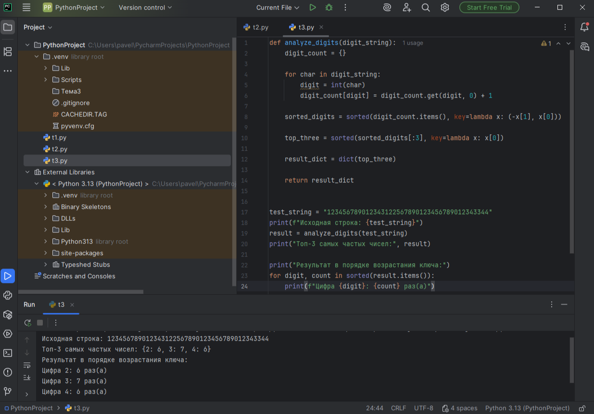

# Тема 6. Базовые коллекции: словари, кортежи.
Отчет по Теме 6 выполнил:

* Шулешов Максим Андреевич 
* ИВТ-23-2

# Лабораторная работа №6.  
## 1) В школе, где вы учились, узнали, что вы крутой программист и попросили написать программу для учителей, которая будет при вводе кабинета писать для него ключ доступа и статус, занят кабинет или нет. При написании программы необходимо использовать словарь (dict), который на вход получает номер кабинета, а выводит необходимую информацию. Если кабинета, который вы ввели нет в словаре, то в консоль в виде значения ключа нужно вывести “None” и виде статуса вывести “False”. По большому счету написав данную программу мы с вами научились заменять иногда громоздкую конструкцию if/elif/else. Поскольку здесь функционал словаря полностью повторяет функционал условия, но при этом у использования словарей в более сложных программах есть намного больше возможностей реализации
```python
request = int(input("Введите номер кабинета: "))
dictionary = {
    101: {'key': 1234, 'access': True},
    102: {'key': 1337, 'access': True},
    103: {'key': 8943, 'access': True},
    104: {'key': 5555, 'access': False},
    None: {'key': None, 'access': False},
}
response = dictionary.get(request)
if not response:
    response = dictionary[None]
key = response get("key")
access = response.get('access')
print(key, access)
```


## 2) Алексей решил создать самый большой словарь в мире. Для этого он придумал функцию dict_maker (**kwargs), которая принимает неограниченное количество параметров «ключ: значение» и обновляет созданный им словарь my_dict, состоящий всего из одного элемента «first» со значением «so easy». Помогите Алексею создать данную функцию. Ниже на скриншоте мы использовали встроенный модуль pprint, который выводит большие объемы информации более понятно для восприятия человеческим глазом. Иногда очень удобно использовать данную возможность Python. 
```python
from pprint import pprint

my_dict = {'first': 'so easy'}

def dict_maker(**kwargs):
    my_dict.update(**kwargs)

dict_maker(a1=1, a2=20, a3=54, a4=13)
dict_maker(name="Михаил", age=31, weight=70, eyes_color="blue")
pprint (my_dict)
```


## 3) Для решения некоторых задач бывает необходимо разложить строку на отдельные символы. Мы знаем что это можно сделать при помощи split(), у которого более гибкая настройка для разделения для этого, но если нам нужно посимвольно разделить строку без всяких условий, то для этого мы можем использовать кортежи (tuple). Для этого напишем любую строку, которую будем делить и “обвернем” ее в tuple и дальше мы можем как нам угодно с ней работать, например, сделать ее списком (тогда получится полный аналог split()) или же работать с ним дальше, как с кортежем.

```python
imput_string = 'HelloWorld"
result = tuple(input_string)
print(result)
print(list(result))
```


## 4) Вовочка решил написать крутую функцию, которая будет писать имя, возраст и место работы, но при этом на вход этой функции будет поступать кортеж. Помогите Вовочке написать эту программу
```python
def personal info(name, age, company="unnamed"):
    print(f"Иня: {name} Возраст: {age} Компания: {company}")

tom = ("Григорий", 22)
personal_info(*tom)
bob = ("Георгий", 41, "Yandex")
personal_info(*bob)
```


## 5) Для сопровождения первых лиц государства X нужен кортеж, но никто не может определиться с порядком машин, поэтому вам нужно написать функцию, которая будет сортировать кортеж, состоящий из целых чисел по возрастанию, и возвращает его. Если хотя бы один элемент не является целым числом, то функция возвращает исходный кортеж.

```python
def tuple_sort(tpl):
    for elm in tpl:
        if not isinstance(elm, int):
            return tpl
    return tuple(sorted(tpl))

if __name__ == '__main__':    
    print(tuple_sort((5, 5, 3, 1, 9)))
    print(tuple_sort((5, 5, 2.1, '1', 9)))
```


# Самостоятельная работа №6. 

## 1) При создании сайта у вас возникла потребность обрабатывать данные пользователя в странной форме, а потом переводить их в нужные вам форматы. Вы хотите принимать от пользователя последовательность чисел, разделенных пробелом, а после переформатировать эти данные в список и кортеж. Реализуйте вашу задумку. Для получения начальных данных используйте input(). Результатом программы будет выведенный список и кортеж из начальных данных.
```python
user_input = input("Введите числа через пробел: ")

numbers_list = user_input.split()

numbers_list = [int(num) for num in numbers_list]

numbers_tuple = tuple(numbers_list)

print("Список:", numbers_list)
print("Кортеж:", numbers_tuple)
```


Вывод: узнал как преобразовывать строку в список чисел через split() и создавать кортежи из списков.


## 2) Николай знает, что кортежи являются неизменяемыми, но он очень упрямый и всегда хочет доказать, что он прав. Студент решил создать функцию, которая будет удалять первое появление определенного элемента из кортежа по значению и возвращать кортеж без него. Попробуйте повторить шедевр не признающего авторитеты начинающего программиста. Но учтите, что Николай не всегда уверен в наличии элемента в кортеже (в этом случае кортеж вернется функцией в исходном виде).
```python
def remove_first_occurrence(tuple_data, element):
    temp_list = list(tuple_data)
    if element in temp_list:
        temp_list.remove(element)
    return tuple(temp_list)

test_cases = [
    ((1, 2, 3), 1),
    ((1, 2, 3, 1, 2, 3, 4, 5, 2, 3, 4, 2, 4, 2), 3),
    ((2, 4, 6, 6, 4, 2), 9)
]

print("Результаты удаления элементов из кортежей:")
for i, (tpl, elem) in enumerate(test_cases, 1):
    result = remove_first_occurrence(tpl, elem)
    print(f"Тест {i}: {result}")
```


Вывод: научился работать с неизменяемыми кортежами - преобразовывать в список для изменений и обратно в кортеж.

## 3) Ребята поспорили кто из них одним нажатием на numpad наберет больше повторяющихся цифр, но не понимают, как узнать победителя. Вам им нужно в этом помочь. Дана строка в виде случайной последовательности чисел от 0 до 9 (длина строки минимум 15 символов). Требуется создать словарь, который в качестве ключей будет принимать данные числа (т. е. ключи будут типом int), а в качестве значений – количество этих чисел в имеющейся последовательности. Для построения словаря создайте функцию, принимающую строку из цифр. Функция должна возвратить словарь из 3-х самых часто встречаемых чисел, также эти значения нужно вывести в порядке возрастания ключа.
```python
def analyze_digits(digit_string):
    digit_count = {}

    for char in digit_string:
        digit = int(char)
        digit_count[digit] = digit_count.get(digit, 0) + 1

    sorted_digits = sorted(digit_count.items(), key=lambda x: (-x[1], x[0]))

    top_three = sorted(sorted_digits[:3], key=lambda x: x[0])

    result_dict = dict(top_three)

    return result_dict


test_string = "123456789012343122567890123456789012343344"
print(f"Исходная строка: {test_string}")
result = analyze_digits(test_string)
print("Топ-3 самых частых чисел:", result)

print("Результат в порядке возрастания ключа:")
for digit, count in sorted(result.items()):
    print(f"Цифра {digit}: {count} раз(а)")
```


Вывод: понял как считать частоту элементов через словарь и сортировать по нескольким критериям (частота и ключ).

## 4) Ваш хороший друг владеет офисом со входом по электронным картам, ему нужно чтобы вы написали программу, которая показывала в каком порядке сотрудники входили и выходили из офиса. Определение сотрудника происходит по id. Напишите функцию, которая на вход принимает кортеж и случайный элемент (id), его можно придумать самостоятельно. Требуется вернуть новый кортеж, начинающийся с первого появления элемента в нем и заканчивающийся вторым его появлением включительно. Если элемента нет вовсе – вернуть пустой кортеж. Если элемент встречается только один раз, то вернуть кортеж, который начинается с него и идет до конца исходного
```python
def find_office_entries(tuple_data, employee_id):
    if employee_id not in tuple_data:
        return ()

    indices = [i for i, x in enumerate(tuple_data) if x == employee_id]

    if len(indices) == 1:
        return tuple_data[indices[0]:]

    return tuple_data[indices[0]:indices[1] + 1]


test_cases = [
    ((1, 2, 3), 8),
    ((1, 8, 3, 4, 8, 8, 9, 2), 8),
    ((1, 2, 8, 5, 1, 2, 9), 8)
]

print("Результаты поиска сегментов:")
for i, (tpl, emp_id) in enumerate(test_cases, 1):
    result = find_office_entries(tpl, emp_id)
    print(f"Тест {i}: {result}")
```


Вывод: узнал как находить индексы элементов в кортеже и делать срезы между определенными позициями.


## 5) Самостоятельно придумайте и решите задачу, в которой будут обязательно использоваться кортеж или список. Проведите минимум три теста для проверки работоспособности вашей задачи.
```python
products = ["сахар", "чай", "кофе", "сливки"]

print("Тест 1 - Начальный список:")
print(products)
print()

print("Тест 2 - Добавляем продукты:")
products.append("газировка")
products.append("масло")
print(products)
print()

print("Тест 3 - Удаляем продукты:")
products.remove("сахар")
print(products)
```


Вывод: закрепил базовые операции со списками - добавление, удаление, проверка наличия элементов.


# Вывод 
Освоил основные операции со словарями и кортежами, решил задачи где они используются.

