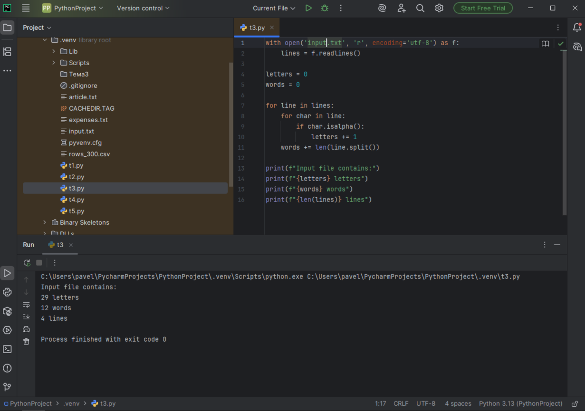

# Тема 7. Работа с файлами (ввод, вывод)
Отчет по Теме 7 выполнил:

* Шулешов Максим Андреевич
* ИВТ-23-2

# Лабораторная работа №7.  
## 1) Составьте текстовый файл и положите его в одну директорию с программой на Python. Текстовый файл должен состоять минимум из двух строк.


## 2) Напишите программу, которая выведет только первую строку из вашего файла, при этом используйте конструкцию open()/close()
```python
f = open('input.txt', 'r')
print(f.readline())
f.close
```


## 3) Напишите программу, которая выведет все строки из вашего файла в массиве, при этом используйте конструкцию open()/close().

```python
f = open('input.txt', 'r')
print(f.readlines())
f.close
```


## 4) Напишите программу, которая выведет все строки из вашего файла в массиве, при этом используйте конструкцию with open().
```python
with open('input.txt') as f:
    print(f.readlines())
f.close()
```


## 5) Напишите программу, которая выведет каждую строку из вашего файла отдельно, при этом используйте конструкцию with open().

```python
with open('input.txt') as f:
    for line in f:
        print(line)
```


## 6) Напишите программу, которая будет добавлять новую строку в ваш файл, а потом выведет полученный файл в консоль. Вывод можно осуществлять любым способом. Обязательно проверьте сам файл, чтобы изменения в нем тоже отображались.

```python
with open('input.txt', 'a+') as f:
    f.write('\nIm additional line')

with open('input.txt', 'r') as f:
    result = f.readlines()
    print(result)
```


## 7) Напишите программу, которая перепишет всю информацию, которая была у вас в файле до этого, например напишет любые данные из произвольно вами составленного списка. Также не забудьте проверить что измененная вами информация сохранилась в файле.

```python
lines = ['one', 'two', 'three']
with open('input.txt', 'w') as f:
    for line in lines:
        f.write('\nCycle run ' + line)
    print('Done!')
```


## 8) Выберите любую папку на своем компьютере, имеющую вложенные директории. Выведите на печать в терминал ее содержимое, как и всех подкаталогов при помощи функции print_docs(directory).

```python
import os

def print_docs(directory):
    all_files = os.walk(directory)
    for catalog in all_files:
        print(f'Палка {catalog[0]} содержит: ')
        print(f'Директории: {", ".join([folder for folder in catalog[1]])}')
        print(f'Файлы: {", ".join([file for file in catalog[2]])}')
    print('-' * 40)

print_docs('C:\\3 курс\\Прог.Инж')
```


## 9) Требуется реализовать функцию, которая выводит слово, имеющее максимальную длину (или список слов, если таковых несколько). Проверьте работоспособность программы на своем наборе данных

```python
def longest_words(file):
    with open(file, encoding= 'utf-8') as f:
        words = f.read().split()
        max_lenght = len(max(words, key=len))
        for word in words:
            if len(word) == max_lenght:
                sought_words = word

        if len(sought_words) == 1:
            return sought_words[0]
        return sought_words

print(longest_words('input.txt'))

```


## 10) Требуется создать csv-файл «rows_300.csv» со следующими столбцами: • № - номер по порядку (от 1 до 300); • Секунда – текущая секунда на вашем ПК; • Микросекунда – текущая миллисекунда на часах. Для наглядности на каждой итерации цикла искусственно приостанавливайте скрипт на 0,01 секунды.

```python
import csv
import datetime
import time

with open('rows_300.csv', 'w', encoding='utf-8', newline='') as f:
    writer = csv.writer(f)
    writer.writerow(['№', 'Секунда ', 'Микросекунда'])
    for line in range(0, 301):
        writer.writerow([line, datetime.datetime.now().second, datetime.datetime.now().microsecond])
        time.sleep(0.01)

```


# Самостоятельная работа №7. 

## 1) Найдите в интернете любую статью (объем статьи не менее 200 слов), скопируйте ее содержимое в файл и напишите программу, которая считает количество слов в текстовом файле и определит самое часто встречающееся слово. Результатом выполнения задачи будет: скриншот файла со статьей, листинг кода, и вывод в консоль, в котором будет указана вся необходимая информация
```python
with open('article.txt', 'r', encoding='utf-8') as f:
    text = f.read()

words = text.split()
print(f"Всего слов: {len(words)}")

word_count = {}
for word in words:
    word = word.lower().strip('.,!?;')
    if word in word_count:
        word_count[word] += 1
    else:
        word_count[word] = 1

most_common = max(word_count, key=word_count.get)
print(f"Самое частое слово: '{most_common}' ({word_count[most_common]} раз)")
```


Вывод: научился подсчитывать слова и находить самые частые в тексте.


## 2) У вас появилась потребность в ведении книги расходов, посмотрев все существующие варианты вы пришли к выводу что вас ничего не устраивает и нужно все делать самому. Напишите программу для учета расходов. Программа должна позволять вводить информацию о расходах, сохранять ее в файл и выводить существующие данные в консоль. Ввод информации происходит через консоль. Результатом выполнения задачи будет: скриншот файла с учетом расходов, листинг кода, и вывод в консоль, с демонстрацией работоспособности программы
```python
with open('expenses.txt', 'a', encoding='utf-8') as f:
    category = input("Категория: ")
    amount = input("Сумма: ")
    f.write(f"{category} - {amount} руб.\n")
    print("Расход сохранен!")

print("\nВсе расходы:")
with open('expenses.txt', 'r', encoding='utf-8') as f:
    print(f.read())
```


Вывод: освоил добавление и чтение данных из файла

## 3) Имеется файл input.txt с текстом на латинице. Напишите программу, которая выводит следующую статистику по тексту: количество букв латинского алфавита; число слов; число строк.
```python
with open('input.txt', 'r', encoding='utf-8') as f:
    lines = f.readlines()

letters = 0
words = 0

for line in lines:
    for char in line:
        if char.isalpha():
            letters += 1
    words += len(line.split())

print(f"Input file contains:")
print(f"{letters} letters")
print(f"{words} words")
print(f"{len(lines)} lines")
```


Вывод: узнал как анализировать текст: буквы, слова, строки

## 4) Напишите программу, которая получает на вход предложение, выводит его в терминал, заменяя все запрещенные слова звездочками * (количество звездочек равно количеству букв в слове)
```python
with open('banned_words.txt', 'r') as f:
    banned = f.read().split()

text = input("Введите текст: ")
text.lower()
result = text


for word in banned:
    result = result.replace(word, '*' * len(word))
    result = result.replace(word.upper(), '*' * len(word))
    result = result.replace(word.capitalize(), '*' * len(word))

print("Результат:")
print(result)
```


Вывод: научился заменять слова в тексте с учетом регистра


## 5) Самостоятельно придумайте и решите задачу, которая будет взаимодействовать с текстовым файлом
```python
search_word = input("Введите слово для поиска: ")

with open('article.txt', 'r', encoding='utf-8') as f:
    text = f.read()

words = text.split()
count = 0

for word in words:
    clean_word = word.strip('.,!?;:"()')
    if clean_word.lower() == search_word.lower():
        count += 1

print(f"Слово '{search_word}' встречается {count} раз")
```


Вывод: освоил точный поиск слов в файле


# Вывод 
Научился работать с файлами: читать, записывать, обрабатывать текст. Освоил базовые операции для анализа и изменения текстовых данных.

